# zhaojiafutheos

# 项目介绍
自己学习跟着沐阳大佬（后面统称阳哥）学习iOS逆向，其实从学习theos之后，就一直想自己写个越狱插件，达到安卓的xposed 通用hook的效果。
后面学习完之后，这几天正好有时间，其实之前学习过程中写了一部分，这几天又花时间补充补充hook点，优化优化，完善我的这个theos tweak插件。
其实沐阳大佬也有《iOS逆向助手》，但是我就想写一个自己的越狱插件。结合电脑直接通过关键词根据日志来过滤使用。
沐阳大佬的《iOS逆向助手》：https://mp.weixin.qq.com/s/RJaCx5TifU8Z8cwXvPWWiw
我这个只能阳哥《iOS逆向助手》的丐版，不喜轻喷，哈哈
其实之前没有想着公开，因为最初阳哥的这个《iOS逆向助手》需要激活码，我这个通用加密部分功能有些类似，不太适合放出来。
经过我最近优化和实战测试，我觉得我的这个插件配合mac的控制台、终端或者Ubuntu的终端，根据 zhaojiafutheos 搜素日志来过滤hook点比较方便。
看个人使用习惯来吧。

插件短时间不会投入过多时间了，后面主要投入到找工作中，多花时间看些之前的学习过的技术栈知识。 
好好准备面试，年后找个工作再说。

# 越狱插件的使用

需要设备：无根越狱手机【有根的我没有研究，手机没有这种iphone手机】
需要安装：ellekit、altlist、preferenceLoader。
还需要沐阳大佬的muyangdemo.ipa app： 沐阳大佬的《iOS逆向助手》：https://mp.weixin.qq.com/s/RJaCx5TifU8Z8cwXvPWWiw   文章有下载地址。

## 安装

ssh连接可以使用finalshell，我个人喜欢用这个，连接服务器和iPhone都方便。（用自己顺手的都行）

ssh连接到设备，文件传到之后：dpkg -i com.zhaojiafu.zhaojiafutheos_0.0.1-5+debug_iphoneos-arm64.deb

## 简单使用：

然后手机打开设置：找到 zhaojiafutheos

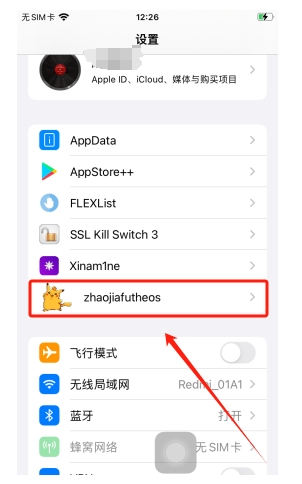

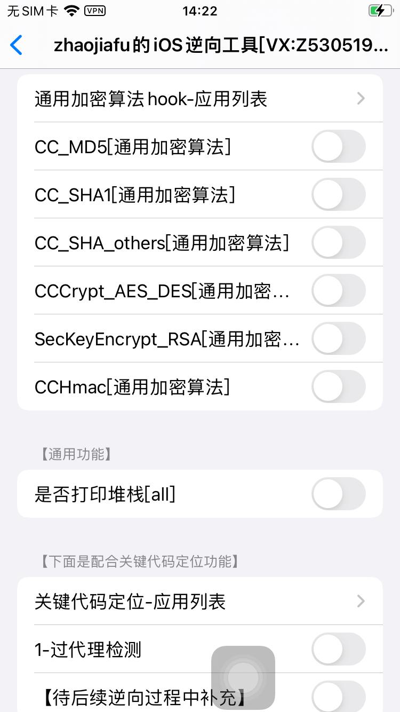

点进去，打开需要hook的加密类型：

比如，进入解密的应用列表，勾选muyangdemo app
勾选需要hook的加密算法。比如我全部勾选上。
进入muyangdemo app。
记得先终端搜素日志：idevicesyslog | grep zhaojiafutheos
也可以mac控制台输入 zhaojiafutheos

## 通用加解密 hook

### md5 hook
按CC_MD5，
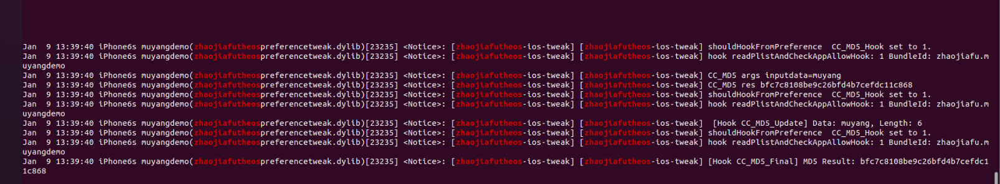

### sha256：(sha1、sha224、sha384、sha512同理)
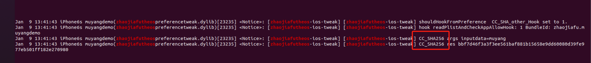

### CChmac sha256：
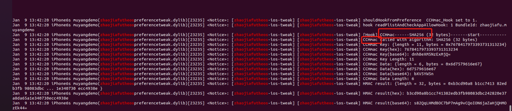

### RSA：

加密：
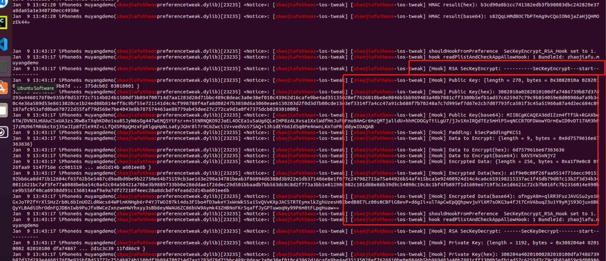

解密：
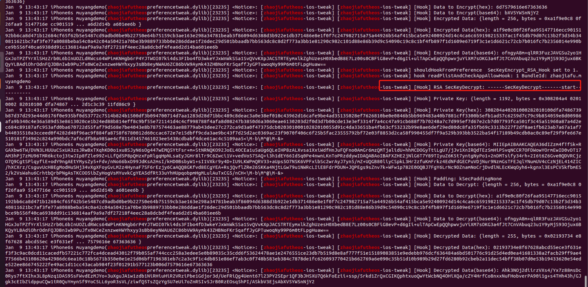

### AES加解密hook
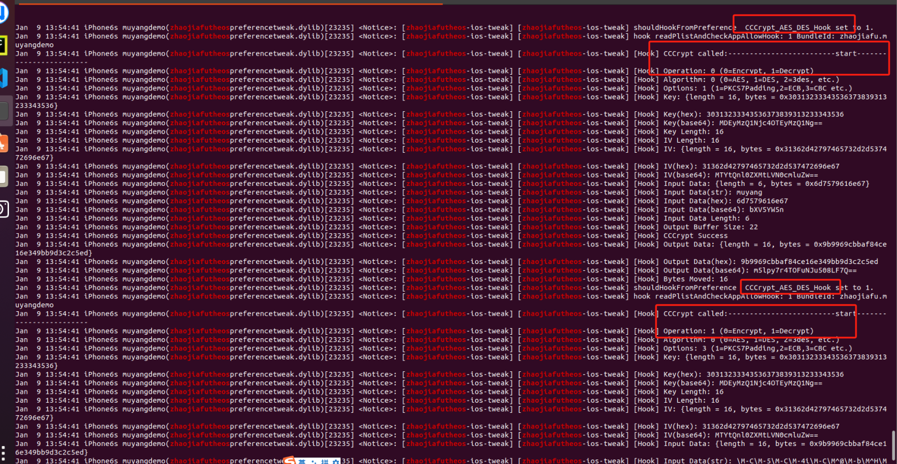

### DES加解密 hook

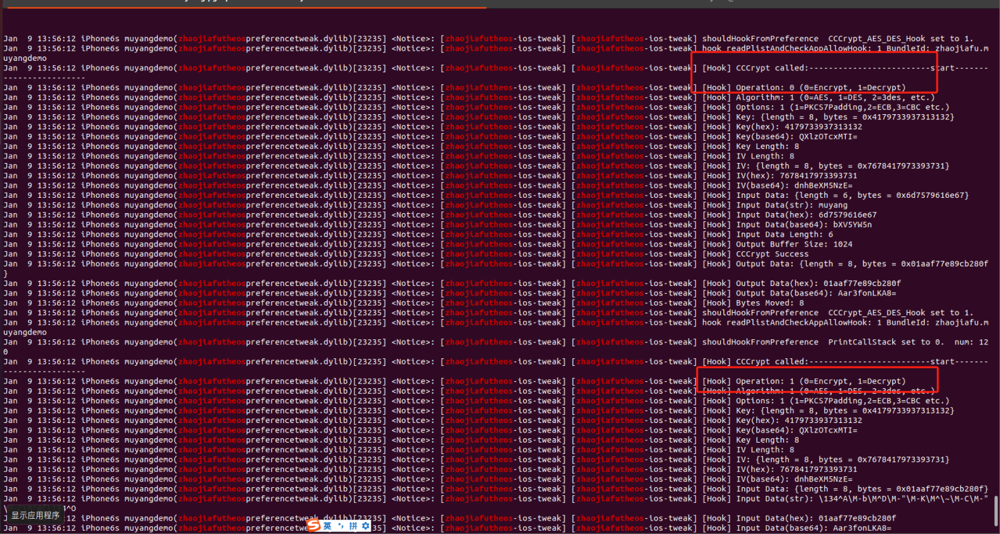

## 过代理检测

选择应用，关键代码定位的应用列表里面选择需要过代理的app

比如还是muyangdemo，网络相关里面的代理检测。

不勾选代理之前：

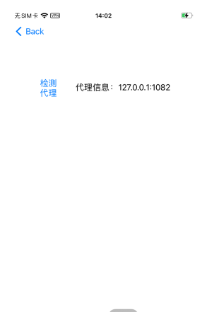

勾选之后：检测不到代理了。

日志也是有的：
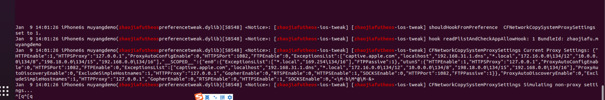

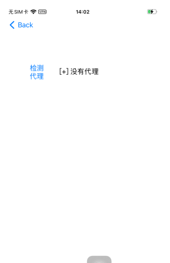

